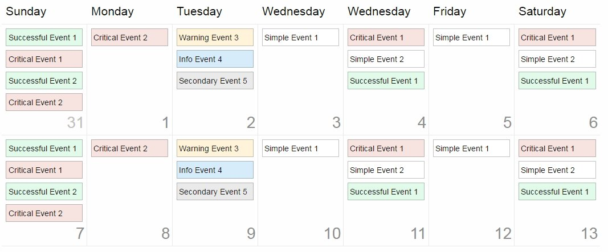

# Schedule layout (Foundation 6 Block Grid Example)

This is an implementation of **Schedule layout** for event planner. Created with [Foundation for Sites](https://github.com/zurb/foundation-sites).

So it's not meant to be a finished product, but just a mockup.

Feel free to edit / manipulate in any way you wish.

## Demo

Here is a live demo of [Schedule layout](https://rufflet.github.io/schedule-foundation-layout/)

## Sources

This project makes use of several other projects:

 - [jQuery](https://github.com/jquery/jquery)
 - [Foundation for Sites](https://github.com/zurb/foundation-sites)
